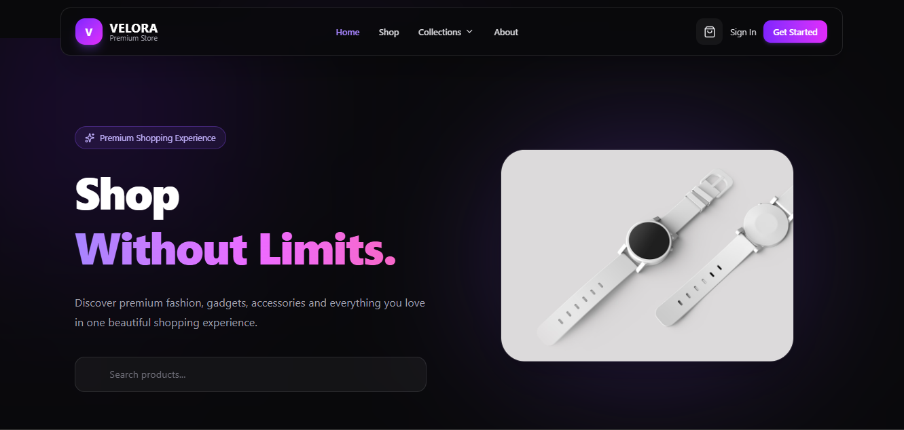

# 🛍️ Velora Backend — E-commerce API



## 🌐 API / Backend Demo

🔗 Backend URL: [Add your deployed backend URL]

🔗 Frontend Repository: [Velora Frontend](https://github.com/adeoyerihanat6-prog/E-commerce_frontend)

---

# 📌 About The Project

**Velora Backend** is a RESTful API built to power the backend infrastructure of the Velora e-commerce platform.

The API handles core e-commerce functionality including user authentication, product management, database operations, and secure communication between the frontend application and the server.

This project was built to demonstrate my backend development skills, including API design, database management, authentication, and building scalable server-side applications.

---

# ✨ Features

## 🔐 Authentication & Authorization

- User registration
- User login
- Secure password hashing
- JWT-based authentication
- Protected routes
- User authorization

---

## 🛍️ Product Management

- Create products
- Retrieve all products
- Retrieve single product details
- Update product information
- Delete products
- Store product information securely

---

## 🛒 Shopping Features

- Manage cart items
- Add products to cart
- Update cart quantities
- Remove products from cart
- Handle user shopping data

---

## 🗄️ Database Management

- MongoDB database integration
- Mongoose schemas and models
- Data validation
- Efficient database queries

---

# 🛠️ Tech Stack

## Backend

- Node.js
- Express.js
- MongoDB
- Mongoose
- JWT Authentication
- bcrypt

## Tools & Services

- Git
- GitHub
- Postman
- MongoDB Atlas
- Render (Deployment)
- Cloudinary (Image Management)

---

# 📂 Project Structure

```bash
E-commerce
│
├── config
│   └── db.js
│
├── controllers
│   ├── userController.js
│   ├── productController.js
│   └── cartController.js
│
├── middleware
│   ├── authMiddleware.js
│   └── errorMiddleware.js
│
├── models
│   ├── User.js
│   ├── Product.js
│   └── Cart.js
│
├── routes
│   ├── userRoutes.js
│   ├── productRoutes.js
│   └── cartRoutes.js
│
├── uploads
│
├── server.js
├── package.json
└── README.md
```

---

# 🔗 API Endpoints

## 👤 Authentication Routes

| Method | Endpoint | Description |
|--------|----------|-------------|
| POST | `/api/users/register` | Register a new user |
| POST | `/api/users/login` | Login user |
| GET | `/api/users/profile` | Get user profile |

---

## 🛍️ Product Routes

| Method | Endpoint | Description |
|--------|----------|-------------|
| GET | `/api/products` | Get all products |
| GET | `/api/products/:id` | Get single product |
| POST | `/api/products` | Create product |
| PUT | `/api/products/:id` | Update product |
| DELETE | `/api/products/:id` | Delete product |

---

## 🛒 Cart Routes

| Method | Endpoint | Description |
|--------|----------|-------------|
| GET | `/api/cart` | Get user cart |
| POST | `/api/cart` | Add item to cart |
| PUT | `/api/cart/:id` | Update cart item |
| DELETE | `/api/cart/:id` | Remove cart item |

---

# 🚀 Getting Started

Follow these steps to run the project locally.

## Prerequisites

Make sure you have:

- Node.js installed
- npm installed
- MongoDB database

---

## Installation

Clone the repository:

```bash
git clone https://github.com/adeoyerihanat6-prog/E-commerce
```

Navigate into the project:

```bash
cd E-commerce
```

Install dependencies:

```bash
npm install
```


## ▶️ Run The Server

Development mode:

```bash
npm run dev
```

Production mode:

```bash
npm start
```

The API will run on:

```bash
http://localhost:5000
```

---

# 🧪 Testing API

The API can be tested using:

- Postman
- Thunder Client

Test authentication, product operations, and protected routes using API requests.

---

# 🔮 Future Improvements

Planned improvements:

- 💳 Payment gateway integration
- 📦 Order management system
- ⭐ Product reviews and ratings
- 📧 Email notifications
- 👨‍💼 Admin dashboard
- 📊 Sales analytics
- 🔔 Real-time notifications

---

# 💡 Challenges & Learnings

Building Velora Backend helped me improve my understanding of:

- Designing RESTful APIs
- Creating secure authentication systems
- Working with MongoDB and Mongoose
- Building scalable backend architecture
- Connecting frontend applications with APIs
- Handling server-side logic and data management

---

# 🤝 Contribution

Contributions, suggestions, and feedback are welcome.

To contribute:

1. Fork the repository

2. Create a new branch:

```bash
git checkout -b feature/NewFeature
```

3. Commit your changes:

```bash
git commit -m "Add new feature"
```

4. Push your branch:

```bash
git push origin feature/NewFeature
```

5. Open a Pull Request

---

# 👩🏽‍💻 Author

## Rihanat Eniola

Full Stack Developer passionate about building modern, responsive, and scalable web applications.

### Connect With Me

- GitHub: [adeoyerihanat6-prog](https://github.com/adeoyerihanat6-prog)
- Portfolio: [Rihanat's Portfolio](https://portfolio-bay-eight-73.vercel.app)
- LinkedIn: [Rihannah Adeoye](https://www.linkedin.com/in/rihanat-adeoye/)
- Twitter/X: [@riha66076](https://x.com/riha66076)

---

⭐ If you found this project useful, consider giving it a star.

Thank you for checking out **Velora Backend**! 💜
